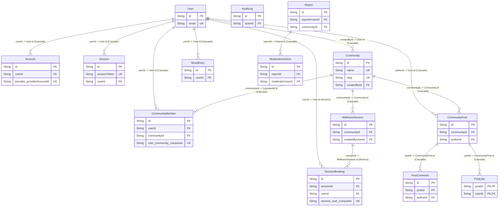

#  AgoraWell
AgoraWell is a production-ready,web application built on Next.js (App Router), TypeScript, and Prisma ORM (PostgreSQL) . The platform provides secure Google OAuth federation, real-time reactive UI elements powered by WebSockets, deterministic concurrency controls for session management, and robust Role-Based Access Control (RBAC).
#  Architectural Pillars & Tech Stack
   ```
Framework Engine: Next.js (App Router) leveraging React Server Components (RSC) to minimize client-side hydrational overhead.

Database & Persistence Layer: PostgreSQL orchestrated via Prisma ORM. Optimized with targeted database indexes, cascade topologies, and Edge-ready execution runtime.

State & Real-Time Sync: Pusher WebSocket framework for zero-latency cross-client updates (e.g., dynamic session capacities).

Security & Federation: NextAuth.js handling secure OAuth 2.0 flows paired with an isolated middleware-driven RBAC engine.

Media Pipeline: UploadThing for secure, streaming multi-part multipart form payloads directly to cloud object storage.

Validation Layer: Zod schema evaluation for runtime type assertion along network and API boundaries.
```
#  Technical Core Features 
## Technical Core Features Deep Dive

### 1. Federated Authentication & Role-Based Access Control (RBAC)
- **Implementation:** `src/app/api/auth/[...nextauth]/route.ts` & `src/lib/rbac/roles.ts`
- **Mechanism:** Integrates NextAuth.js configured with a PostgreSQL database adapter (PrismaClient). On authorization, JWT tokens are synthesized into session objects.
- **RBAC Engine:** Access to view, moderate, or modify resources is evaluated using the `CommunityMember` mapping table. Before any sensitive operation runs, the system cross-references the `CommunityRole` (ADMIN, MODERATOR) against the target `communityId` to prevent unauthorized cross-tenant data access.

### 2. Concurrency-Safe Booking & Real-Time Sync Engine
- **Implementation:** `src/server/services/sessionService.ts` & `src/components/community/RealtimeSessionList.tsx`
- **The Concurrency Problem:** Multiple users attempting to book the last available seat in a `WellnessSession` simultaneously can lead to race conditions and overbooking.
- **The Solution:** The `sessionRepo` executes atomic database updates. When a seat is reserved, it performs a transaction that verifies capacity criteria before altering the record:  
  $$\text{seatsRemaining} > 0$$
- **Real-Time Broadcast:** Upon a successful atomic booking commit, a server-side event is fired through `pusher-server.ts`. This instantly pushes a synchronization payload across client sockets. The client-side `RealtimeSessionList.tsx` component intercepts the payload and re-renders the UI without requiring a full page refresh.

### 3. Media Ingestion Pipeline via Cloud Providers
- **Implementation:** `src/app/api/uploadthing/core.ts` & `src/utils/uploadthing.ts`
- **Mechanism:** Handled via custom ingestion endpoints. File uploads bypass the main application server, streaming large binary object streams (like community post images) directly to cloud storage providers. The server only captures the verified return metadata link string (`imageUrl`), maximizing API thread performance.

### 4. Content Moderation & Comprehensive Compliance Ledger
- **Implementation:** `src/server/actions/moderationActions.ts`
- **Mechanism:** Users can flag session via the `Report` schema specifying an entity context (`ReportReason`). Designated community moderators can view open issues on the moderation dashboard (`src/app/(dashboard)/moderation/page.tsx`).
- **Audit Logs:** Actions that affect user data invoke the `AuditLog` tracking pipeline. It records the actor ID, entity reference, timestamp, and metadata payload inside JSON columns. This provides an unalterable history of platform activity for administrative oversight.
   
        
          

```
NG_CREATED | BOOKING_CANCELLED | POST_DELETED
```

#  Folder Directory Structure 
```
├── prisma/
│   ├── migrations/                 # Immutable database state evolution logs
│   ├── schema.prisma               # Source of truth for database topology and enums
│   └── seed.ts                     # Deterministic database seeding automation script
├── src/
│   ├── actions/                    # Global Next.js Server Actions (e.g., global mutations)
│   ├── app/                        # Next.js App Router routing matrix
│   │   ├── api/                    # Fully isolated RESTful/Webhook endpoints (NextAuth, UploadThing)
│   │   ├── (auth)/                 # Unauthenticated authentication layout scopes
│   │   └── (dashboard)/            # Authenticated layout engine with navigation contexts
│   ├── components/                 # Atomic, decoupled React UI Components
│   │   ├── community/              # Domain components (Posts, Realtime Session lists)
│   │   ├── dashboard/              # Reactive widgets (Mood trackers, quick actions)
│   │   └── layout/                 # Structural shells (AppShell, SideNav, TopNav)
│   ├── lib/                        # Operational primitives & singletons
│   │   ├── auth/                   # RBAC matrix evaluation frameworks
│   │   ├── validation/             # Strict Zod domain schemas
│   │   └── pusher.ts               # Real-time WebSocket connectivity initializers
│   ├── server/                     # Sovereign Business Logic Layer
│   │   ├── actions/                # Context-scoped Server Actions (Booking, Moderation)
│   │   ├── repos/                  # Core Repository Layer (Raw SQL / Prisma execution queries)
│   │   └── services/               # Core Service Layer (Business rules, invariants validation)
│   └── __tests__/                  # Unit and integration test suites (Booking invariants)
```
#  Database Architecture 

```## 📊 Relational Database Architecture & Schema Topology

AgoraWell enforces strict relational integrity at the database tier using **Primary Keys (PK)**, **Foreign Keys (FK)**, and **Unique Constraints/Keys (UK)** via PostgreSQL. 

### Entity-Relationship Diagram (ERD)

The diagram below highlights the precise cryptographic keys, foreign key pairings, and data structural layout:



##  Deployment & Installation Blueprint

### Prerequisites
- **Node.js:** v20.x or higher
- **Database Engine:** PostgreSQL instance (v15 or newer) (we used neon in this project) 
- **Real-time Engine Provider:** Pusher Account App Credentials
- **Storage Provider:** UploadThing API Tokens

### Environment Setup Matrix
Create a root `.env` file containing the following infrastructure connection strings:

```env
# Persistence Engine Connection Configuration
DATABASE_URL="postgresql://<username>:<password>@<host>:<port>/agorawell?schema=public"

# NextAuth Cryptographic Ingress Definitions
NEXTAUTH_SECRET="your-high-entropy-long-crypto-secure-string"
NEXTAUTH_URL="http://localhost:3000"

# Federated Authorization Providers
GOOGLE_CLIENT_ID="your-google-client-id-from-console"
GOOGLE_CLIENT_SECRET="your-google-client-secret"

# Real-Time WebSocket Infrastructure Definitions
NEXT_PUBLIC_PUSHER_APP_KEY="your-pusher-key"
PUSHER_APP_ID="your-pusher-id"
PUSHER_SECRET="your-pusher-secret"
NEXT_PUBLIC_PUSHER_CLUSTER="your-pusher-cluster"

# Ingestion Media Pipeline Credentials
UPLOADTHING_SECRET="your-uploadthing-secret"
UPLOADTHING_APP_ID="your-uploadthing-app-id"
```
## Development Execution Cycle

1. **Clone the repository and install dependency maps:**
   ```bash
   git clone https://github.com/giant101bone/AgoraWell.git
   cd AgoraWell
   npm install
   ```
   # run database migration
   ```npx prisma migrate dev```
   #Populate the database with core system seeds
   ```npx prisma db seed ```
   #Boot the local development server
   ```npm run dev```
   
   
   
